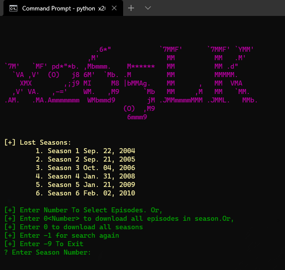

# x265lk-API

**Only For Personal Use**

## Usage

```git
git clone https://github.com/HRS0986/x265lk-API.git
cd x265lk-API
pip install -r requirements.txt
python x265cli.py
```





Binaries are available for windows. Download from here.

## Getting Started with API Client

```python
>>> from x265lk import x265LK
>>> x265lk = x265LK()
```

**Search TV Series**

```python
>>> tv_result = x265lk.search('lost')
>>> print(tv_result)
{
    'response_code': 1, 
    'status_code': 200, 
    'data': [
        {
            'id': '22505', 
            'title': 'Lost', 
            'url': 'https://x265lk.com/tvshows/lost/'
        }, 
        {
            'id': '20484', 
            'title': 'Lost in Space', 
            'url': 'https://x265lk.com/tvshows/lost-in-space/'
        }
    ]
}
```

**Search Movies**

```python
>>> movie_result = x265lk.search('lost', tv=False)
>>> print(movie_result)
{
    'response_code': 1, 
    'status_code': 200, 
    'data': [
        {'id': '25259', 
        'title': 'Girl Lost: A Hollywood Story', 
        'url': 'https://x265lk.com/movies/girl-lost-a-hollywood-story/'
        }, 
        {
            'id': '25158', 
        'title': 'The Lost World: Jurassic Park', 
        'url': 'https://x265lk.com/movies/the-lost-world-jurassic-park/'
        }, 
        {
            'id': '16400', 
        'title': 'The Lost City of Z', 
        'url': 'https://x265lk.com/movies/the-lost-city-of-z/'
        }
    ]
}
```

**Get Season's Data Of A TV Series**

```python
>>> seasons_data = x265lk.extract_seasons('hhttps://x265lk.com/tvshows/chernobyl/')
>>> print(seasons_data)
{
    'response_code': 1, 
    'status_code': 200, 
    'data': [
        {
            'season_no': 'Season 1', 
            'date': 'May. 06, 2019', 
            'episodes': [
                {
                    'epi_no': '1', 
                    'epi_name': '1:23:45', 
                    'epi_link': 'https://x265lk.com/episodes/chernobyl-1x1/', 
                    'epi_date': 'May. 06, 2019'
                }, 
                {
                    'epi_no': '2', 
                    'epi_name': 'Please Remain Calm', 
                    'epi_link': 'https://x265lk.com/episodes/chernobyl-1x2/', 
                    'epi_date': 'May. 13, 2019'
                }, 
                {
                    'epi_no': '3', 
                    'epi_name': 'Open Wide, O Earth', 
                    'epi_link': 'https://x265lk.com/episodes/chernobyl-1x3/', 
                    'epi_date': 'May. 20, 2019'
                }, 
                {
                    'epi_no': '4', 
                    'epi_name': 'The Happiness of All Mankind', 
                    'epi_link': 'https://x265lk.com/episodes/chernobyl-1x4/', 
                    'epi_date': 'May. 27, 2019'
                }, 
                {
                    'epi_no': '5', 
                    'epi_name': 'Vichnaya Pamyat', 
                    'epi_link': 'https://x265lk.com/episodes/chernobyl-1x5/', 
                    'epi_date': 'Jun. 03, 2019'
                }
            ]
        }
    ]
}
```

**Get All Copies Of A Movie**
```python
>>> movie_copies_data = x265lk.extract_movie_or_episode_copy(False, 'https://x265lk.com/movies/tenet/')
>>> print(copies_data)
{
    'response_code': 1, 
    'status_code': 200, 
    'data': [
        {
            'copy_name': 'x265 720p 10Bit BluRay', 
            'url': 'https://x265lk.com/links/z8dkhkvddw/', 
            'size': '1GB'
        }, 
        {
            'copy_name': 'x265 1080p 10Bit BluRay', 
            'url': 'https://x265lk.com/links/n8w5qmnd60/', 
            'size': '1.9GB'
        }, 
        {
            'copy_name': 'x265 1080p 10Bit BluRay', 
            'url': 'https://x265lk.com/links/offj5mewii/', 
            'size': '1.6GB'
        }, 
        {
            'copy_name': 'x265 720p 10Bit HD', 
            'url': 'https://x265lk.com/links/shetj38v2m/', 
            'size': '830MB'
        }, 
        {
            'copy_name': 'x265 720p HD', 
            'url': 'https://x265lk.com/links/hclsbyqr2n/', 
            'size': '520MB'
        }, 
        {
            'copy_name': 'x265 720p BluRay', 
            'url': 'https://x265lk.com/links/7outgl4mnh/', 
            'size': '700MB'
        }, 
        {
            'copy_name': 'x265 2160p 4K BluRay', 
            'url': 'https://x265lk.com/links/vda9asze2d/', 
            'size': '3.1GB'
        }, 
        {
            'copy_name': 'x265 720p BluRay', 
            'url': 'https://x265lk.com/links/jmuuzbrxli/', 
            'size': '870MB'
        }, 
        {
            'copy_name': 'x265 1080p WEB', 
            'url': 'https://x265lk.com/links/y3wg9rjhkl/', 
            'size': '880MB'
        }, 
        {
            'copy_name': 'x265 720p WEB', 
            'url': 'https://x265lk.com/links/herjnxziur/', 
            'size': '600MB'
        }
    ]
}
```

**Get All Copies Of A Episode**
```python
>>> episode_copies_data = x265lk.extract_movie_or_episode_copy(True, 'https://x265lk.com/episodes/supernatural-1x1/')
>>> print(episode_copies_data)
{
    'response_code': 1, 
    'status_code': 200, 
    'data': [
        {
            'copy_name': 'x265 720p HDTV', 
            'url': 'https://x265lk.com/links/aozolnz5bk/', 
            'size': '175MB'
        }
    ]
}
```
**Get Final Download Link Of A Movie Or Episode**
```python
>>> link = x265lk.get_download_link(episode_copies_data['data'][0]['url'])
>>> print(link)
{
    'response_code': 1, 
    'status_code': 200, 
    'data': 'https://dl.x265lk.cloud/0:/TV%20Shows/English%202/Supernatural/Season%2001/www.x265lk.com.Supernatural.S01E01.720p.x265.HDTV.mkv'
}

>>> link = x265lk.get_download_link('https://x265lk.com/links/shetj38v2m/')
>>> print(link)
{
    'response_code': 1, 
    'status_code': 200, 
    'data': 'https://dl2.x265lk.cloud/0:/Movies/English/Tenet%202020/www.x265lk.com.Tenet.2020.720p.10bit.HDRip.2CH.HEVC.x265.mkv'
}
```

**Download**
```python
>>> d = x265lk.download(link['data'], 'D:\\Movies', progress=False)
>>> print(d)
{
    'response_code': 1, 
    'status_code': 200, 
    'data': 'D:\\Movies\\www.x265lk.com.Tenet.2020.720p.10bit.HDRip.2CH.HEVC.x265.mkv'
}

# If response_code is 1, Download Completed
# Data is the downloaded path
```

**Get Years**

```python
>>> y = x265lk.get_years()
>>> print(y)
...

```

**Get Movies Or TV Series By Released Year**

```python
>>> ymt = x265lk.get_by_year('1993')
>>> print(ymt)
{
    'response_code': 1, 
    'status_code': 200, 
    'data': {
        'movies': [
            {
                'title': 'Hocus Pocus', 
                'url': 'https://x265lk.com/movies/hocus-pocus/'
            }, 
            {
                'title': 'Batman: Mask of the Phantasm', 
                'url': 'https://x265lk.com/movies/batman-mask-of-the-phantasm/'
            }, 
            {
                'title': 'Jurassic Park', 
                'url': 'https://x265lk.com/movies/jurassic-park/'
            }, 
            {
                'title': 'Teenage Mutant Ninja Turtles III', 
                'url': 'https://x265lk.com/movies/teenage-mutant-ninja-turtles-iii/'
            }
        ], 
        'tv_series': [
            {
                'title': 'The X-Files', 
                'url': 'https://x265lk.com/tvshows/the-x-files/'
            }
        ]
    }
}
```

**Get Genres**

```python
>>> g = x265lk.get_genres()
>>> print(g)
...

```

---

**Get Moviea and TV Series Of A Genre**

```python
>>> gmt = x265lk.get_by_genre('war-politics')
>>> print(gmt)
{
    'response_code': 1, 
    'status_code': 200, 
    'data': {
        'movies': [], 
        'tv_series': [
            {
                'title': 'Bodyguard', 
                'url': 'https://x265lk.com/tvshows/bodyguard/'
            }, 
            {
                'title': 'SEAL Team', 
                'url': 'https://x265lk.com/tvshows/seal-team/'
            }, 
            {
                'title': 'Scarlet Heart: Ryeo', 
                'url': 'https://x265lk.com/tvshows/scarlet-heart-ryeo/'
            }, 
            {
                'title': 'Avrodh – The Siege Within', 
                'url': 'https://x265lk.com/tvshows/avrodh-the-siege-within/'
            }, 
            {
                'title': 'The K2', 
                'url': 'https://x265lk.com/tvshows/the-k2/'
            }, 
            {
                'title': 'Tom Clancy’s Jack Ryan', 
                'url': 'https://x265lk.com/tvshows/tom-clancys-jack-ryan/'
            }, 
            {
                'title': 'Band of Brothers', 
                'url': 'https://x265lk.com/tvshows/band-of-brothers/'
            }
        ]
    }
}
```

## Direct Downloader Tool

*Binary file is available for windows*

```
python x265Downloader.py -h
usage: x265lk LINK PATH [-s <seasonNumbers>] [-e <episodeNumbers>]

x265lk.com Terminal Downloader

positional arguments:
  LINK                Movie Or TV Series Link
  PATH                Download Location Path

optional arguments:
  -h, --help          show this help message and exit
  -s SeasonNumbers    Season Numbers To Download
  -e EpisodeNumbers,  Episode Numbers To Download

By Hirusha Fernando
```

---

**Examples:**

Download Full TV Series<br/>
`python x265Downloader.py https://x265lk.com/tvshows/lost-in-space/`

Download Certain Seasons Of A TV Series<br/>
`python x265Downloader.py https://x265lk.com/tvshows/lost/ -s 2,3`

Download Certain Episodes Of A Season<br/>
`python x265Downloader.py https://x265lk.com/tvshows/lost/ -s 2 -e 3,6,7`

Download Movie<br/>
`python x265Downloader.py https://x265lk.com/movies/tenet/`
